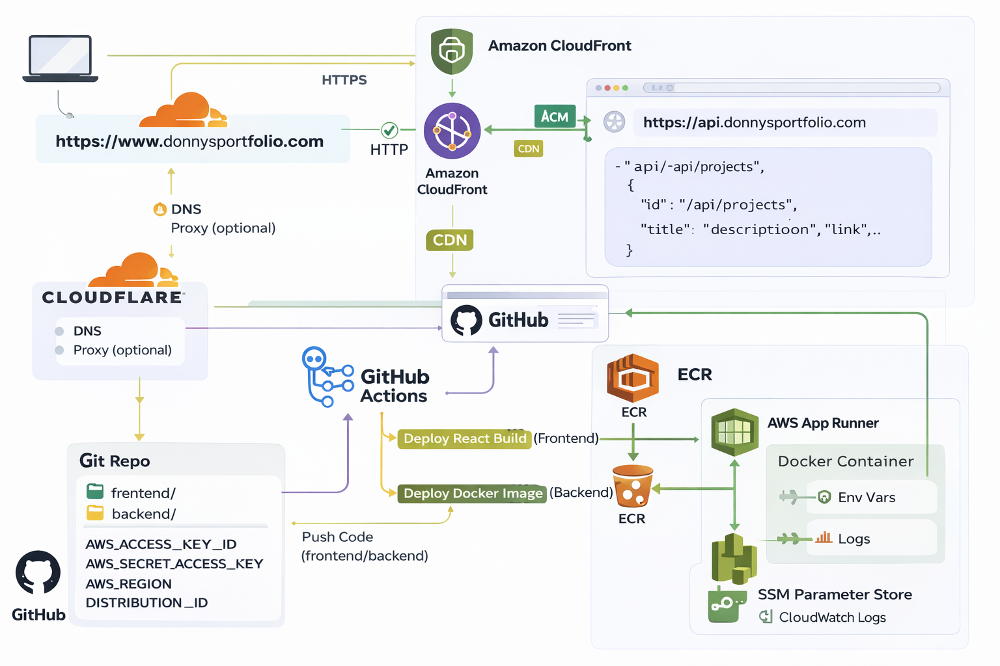

# DonnyJungsPortfolioPage
AWS Cloud + GitHub CI/CD practice
## Architecture

AWS Resources:
- S3: Hosts the static portfolio website (frontend).
- CloudFront (CDN): Caches and delivers the S3 site globally with HTTPS.
- App Runner: Runs the Dockerized Django API service (backend).
- ECR: Stores container images for deployment.
- SSM Parameter Store: Manages runtime configuration and secrets (e.g., SECRET_KEY, ALLOWED_HOSTS, CORS origins).
- CloudWatch Logs (minimal): Collects and monitors App Runner logs for troubleshooting.
- ACM: Issues and manages TLS/SSL certificates for custom domains (used by CloudFront/App Runner).

Tech Stack:
- Backend: Django (Python)
- Frontend: React
- Containerization: Docker (build & run container images)
- CI/CD: GitHub Actions
